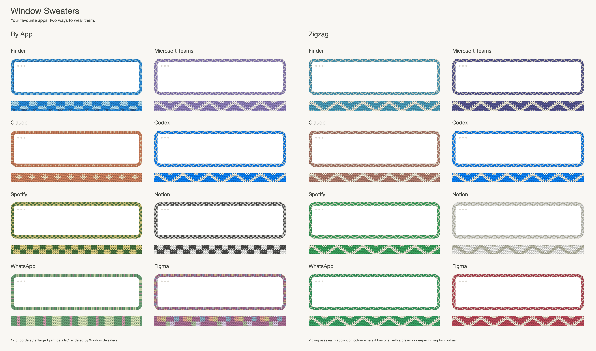

# Window Sweaters

A little Mac app I made to give my windows sweaters. 🧶
Knitted borders, colours inspired by your favourite apps, and a cosier desktop.


## Get it

You can just send this repo to your coding agent and ask it to install Window Sweaters for you:

> Install Window Sweaters on my Mac: https://github.com/saragordic/window-sweaters

Or install it yourself with [Homebrew](https://brew.sh):

```sh
brew trust saragordic/tap
brew install --cask saragordic/tap/window-sweaters
```

Then open **Window Sweaters** from your Applications folder.

You can also grab the latest ZIP from [Releases](https://github.com/saragordic/window-sweaters/releases), unzip it, and drag **Window Sweaters.app** into Applications.

If macOS blocks it, open **System Settings → Privacy & Security → Open Anyway** after trying to launch it. The app isn't notarized by Apple yet. [Apple's instructions](https://support.apple.com/en-us/102445) explain this step.

## Make yourself cosy

Click the yarn icon in your menu bar to change the style, pattern, border width, and stitch size. You can also pause the sweaters or quit from there.

**By App** gives each app its own sweater. **Zigzag** gives them all a softer, matching pattern in their own colours. Try both and see what you like.

If macOS asks for Accessibility access, enable Window Sweaters in **System Settings → Privacy & Security → Accessibility** so it can follow which window is focused.

### Sweater weather

Choose **Weather → Automatic below 60°F / 15.56°C** to let the local weather
control all eligible window sweaters. Allow macOS Location Services when asked;
there is no account, API key, or city to enter. The feature is off by default.

Sweaters turn on strictly below **60°F (15.555…°C)** and off at or above it.
The menu shows both units and the last successful check time. Weather refreshes
every hour, after waking if the last successful check is at least an hour old,
or with **Check Weather Now**. Existing
app exclusions and window eligibility rules still apply.

If location permission is denied, enable it in **System Settings → Privacy &
Security → Location Services** and check again. If location or weather is
unavailable, the current sweater state stays unchanged while the app retries.
**Show Sweater Borders** exits automatic mode and takes manual control. Turning
off automatic mode restores your saved manual preference. The automatic choice
survives restart; until fresh weather arrives, the saved manual state is used.

Location is requested at kilometre accuracy and rounded to two decimal places
before being sent over HTTPS to [Open-Meteo](https://open-meteo.com/). Coordinates
are not saved in preferences or logged by the app. The provider receives these
rounded coordinates and your IP address. Weather uses Open-Meteo's current
modelled outdoor temperature, not an indoor sensor or feels-like temperature.
See [Open-Meteo's privacy policy](https://open-meteo.com/en/terms#privacy).

## The sweaters



Some of my favourites, in By App and Zigzag. You can see the whole collection and close-up stitches in the [catalogue](docs/COLLECTION.md), or download the [By App PDF](docs/catalogues/Window-Sweaters-Catalogue.pdf) and [Zigzag PDF](docs/catalogues/Window-Sweaters-Zigzag-Catalogue.pdf).

The app colours are picked by hand, not read from your app icons. Apps without their own sweater still get a border in a colour chosen from their name, so it stays the same every time.

## A little work in progress

I built this on my Mac and use it myself, but there are still rough edges. Borders hide while you resize a window and return when you're done.

Sweaters reveal outward over 300 ms whenever they appear, including weather
activation, new windows, and returning after resize or hide/restore. The finished
fabric is revealed without stretching stitches or fading the wool. Moving a
visible window does not restart the animation. macOS **Reduce Motion** makes
appearances instant.

The app is built for **macOS 13 or later, on Apple Silicon and Intel**. I've tested it on Apple Silicon with macOS 26; older macOS versions and Intel Macs haven't had the same hands-on testing. It uses private macOS window APIs, so system updates may affect how it works.

If something looks wrong, [open an issue](https://github.com/saragordic/window-sweaters/issues) and tell me your macOS version, Mac model, and whether you're using another screen. Reproduction steps help a lot.

## Build it yourself

You'll need Apple's Command Line Tools (`xcode-select --install`) and Python 3.

```sh
git clone https://github.com/saragordic/window-sweaters.git
cd window-sweaters
./scripts/build-app.sh
python3 scripts/install-local.py
```

This builds `outputs/Window Sweaters.app`, installs it in `~/Applications`, and opens it. The installer backs up any previous local installation before replacing it.

## Your own colourways

If you'd like to experiment, edit these files and restart the app:

```text
~/Library/Application Support/Knit Borders/apps.conf
~/Library/Application Support/Knit Borders/charts/
```

The folder still uses the app's original name so existing settings keep working. For example, an app rule looks like this:

```text
Claude = #D58561 atelier-claude
```

Names match app-name prefixes, ignoring capitalisation; the longest match wins. You can also put your own PNG charts in the charts folder to replace built-in patterns.

If you like setting things up from the command line, Window Sweaters also runs an optional shell script at startup, if you have one at `~/.config/window-sweaters/sweatersrc` or `~/.sweatersrc`.

## Contributing

```sh
make test       # run the tests
make catalogue  # render the sweater collection
make bench     # benchmark the renderer
```

See [CONTRIBUTING.md](CONTRIBUTING.md) for more details.

## Credits and license

Built on [JankyBorders](https://github.com/FelixKratz/JankyBorders) by Felix Kratz, with thanks. Released under [GPL-3.0](LICENSE). See [NOTICE.md](NOTICE.md) for attribution.
